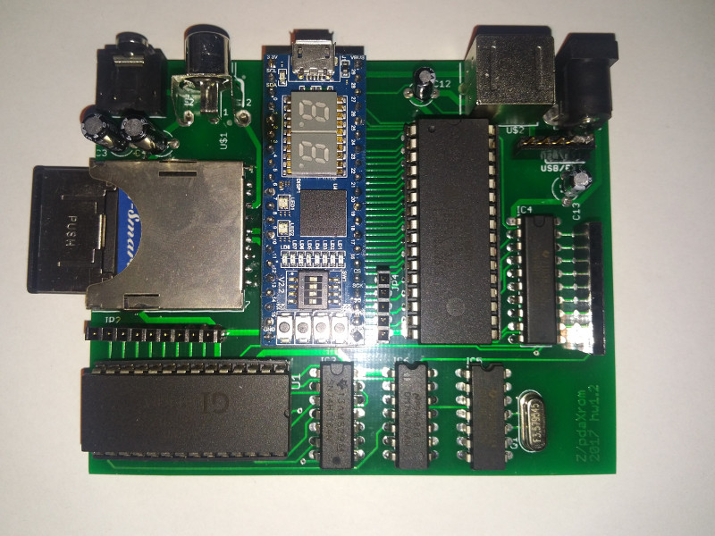

## Pyldin-601 compatible retrocomputer.

[History](docs/HISTORY.md)

### Overview hardware version 1.2:

 Function | Description 
----|----
CPU | [System 11 - VHDL 68HC11](http://members.optusnet.com.au/jekent/system11/)
FPGA| [Lattice MachXO2-4000HC module](http://www.stepfpga.com)
RAM | Builtin FPGA 4KB and/or external static ram 128KB
ROM | Builtin FPGA BOOTROM 2KB
Keyboard | PS/2
Serial port | UART (via keyboard connector)
Video | TV (b/w)
Audio | AY-3-8912
Storage | MMC/SD
Other | Onboard SPI and CS ports, 8 bit parallel port (limited to output only)

